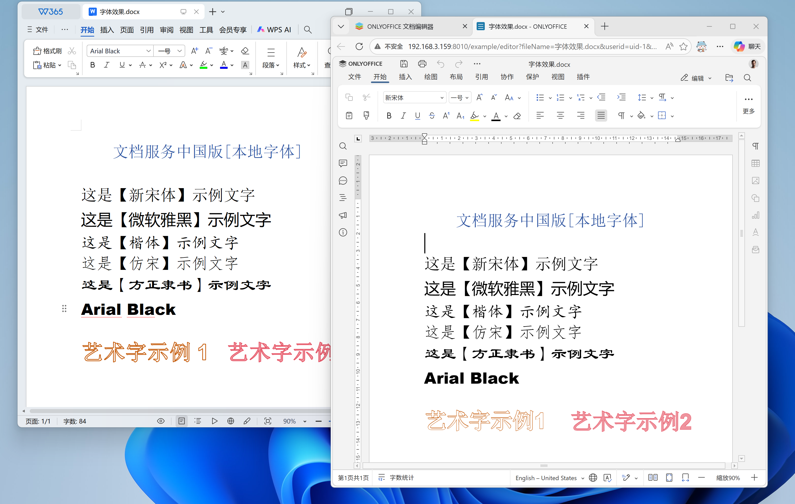
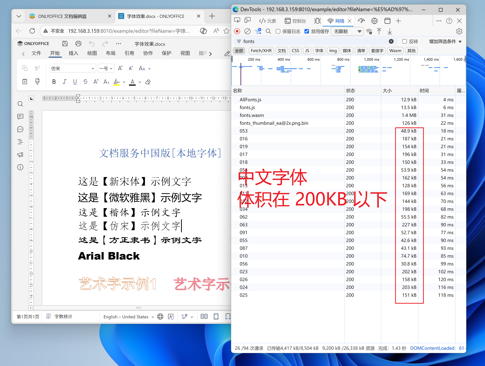

# 五星功能 / 强烈推荐👍👍👍

> [!TIP]  
> 以下功能基于最新高级版，为单独增强功能，如有需要请联系交流群（183026419）管理员

## 本地字体

中国版的 documentserver 中，新增了“字体裁剪双轨制”，我们称之为 **`本地字体`**：

- **西文字体**与**图标字体**默认不裁剪，走原来的解析、排版计算、渲染逻辑
- **CJK（中日韩）字体**裁剪后，仅保留排版计算需要的测量表，解析及排版计算依然走之前的逻辑，渲染时根据配置自动探测浏览器本地字体，自动回落到可用字体

这样既保证了排版计算的准确性（文字效果与艺术字与原版渲染效果基本无差异），又大幅减少了网络传输的字体体积。

这套方案同时对 PC 和 Mobile 模式生效，对于安卓设备无法缓存字体问题也会得到很大缓解。前已在 documentserver 中国版最新版本中落地，效果显著。

方案原文链接 [OnlyOffice 开档及字体加载慢——问题剖析与优化落地实战](https://onlyoffice.moqisoft.com/post/browserfont)

#### 实战效果

在一个空白 Word 文档场景中：

| 对比项                 | 优化前    | 优化后                  |
| ---------------------- | --------- | ----------------------- |
| 中文字体下载（SimSun） | 18MB      | 289KB                   |
| 打开时间               | 8~12s     | 2~4s（速度提升 3~4 倍） |
| 完整字体               | **416MB** | **21MB**                |

如果文档中 CJK 字体存在多个，这个差异还会更明显。

按上述方案执行后，文档服务中国版 fonts 目录下所有字体，由优化前的 **416MB** 减少至优化后的 **21MB**，减少了 **95%**。

#### 本地字体与wps效果对比

#### 字体下载体积对比
